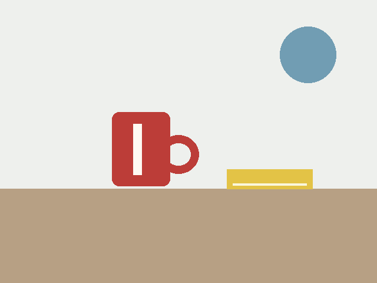

# 两个完整示例：说一句话，得到可用提示词

安装后，在支持这个 Skill 的助手中使用下面的输入。需要明确调用时，在开头加 `$image-prompt-builder`。

以下两例直接摘录 v1.0.0 试用记录的 C01、C02，展示“用户输入 → 完整输出 → 自动补充了什么”。图片是自制输入素材，尚未生成编辑后的成品。

## 示例一：做一张小红书教程封面

### 用户只需要说

```text
帮我写一段小红书教程封面的生图提示词，标题逐字是“AI修图小技巧”，竖版2:3，不要任何其他文字。
```

### Skill 当次完整输出

```text
制作一张小红书教程封面，竖版，画面宽高比为2:3。以清晰醒目的标题为视觉中心，标题逐字使用“AI修图小技巧”，排版整齐，缩小后仍易于阅读。搭配简洁的图像编辑主题图形，保持画面干净、层次明确，装饰不遮挡标题。全图只出现“AI修图小技巧”这段文字，不添加副标题、编号、说明、品牌、水印或其他文字。
```

验收项：
- 画面为竖版2:3。
- 标题准确显示“AI修图小技巧”，清晰可读。
- 没有任何其他文字。

### 它替用户补了什么

用户已经确定标题、比例和不要其他文字。助手进一步补充标题作为视觉中心、缩小后的可读性、装饰不遮字，以及副标题、编号、水印等容易混入画面的限制。没有让用户逐项填写构图表。

标题文案、2:3竖版、无其他文字，这3项明确要求都写进了提示词；图片是否全部做到，要在实际出图后检查。装饰图形属于本次补充的表达方案，用户可以要求删掉。

### 接下来怎么用

把代码块里的提示词复制到你的生图工具。出图后检查：比例对不对、标题有没有错字、是否多出其他文字。

## 示例二：只把杯子换个颜色

### 上传这张输入图



[下载原图](../tests/fixtures/desk.png)。测试素材采用简单色块，便于看清改动和保留项。

### 用户只需要说

```text
把图里的红杯子改成蓝色，其他地方不变，帮我写提示词。
```

### Skill 查看原图后的当次完整输出

```text
编辑上传的原图，将画面左侧杯子的红色杯身和红色杯柄改为蓝色。保留杯身上的白色竖条，保留杯子的轮廓、大小、位置以及杯柄形状。保持原图的平面色块风格，换色边缘干净，与原图自然衔接。桌面、浅色背景、右侧黄色书本及其白色横线、右上方蓝色圆形装饰均保持原样，不移动或增删任何物体。仅修改杯子原有的红色区域及换色所需的边缘融合。
```

验收项：
- 杯身和杯柄由红色变为蓝色。
- 白色竖条、杯子形状和位置保持原样。
- 桌面、书本和背景装饰未被改动。

### 它替用户补了什么

用户只说了“红杯子改蓝色，其他地方不变”。助手把“其他地方”拆成原图里实际可见的白色竖条、杯子形状和位置、桌面、书本及背景装饰，补出可逐项检查的保留要求。

这里换的是整个红杯子的红色部分，包含杯柄；如果只想改杯身，需要明确说“只改杯身，杯柄保持红色”。

### 接下来怎么用

把提示词和这张原图一起上传到图像编辑工具。检查3组目标：杯身和杯柄是否变蓝；白色竖条及杯子形状、位置是否保留；书本、桌面和背景是否保留。

如果图案被改掉，将原图和生成结果一起发回助手，再说“颜色对了，但白色竖条被改了，帮我写下一轮修改提示词”。只有看到两张图后，才能检查发生了哪些变化。

## 这个示例证明了什么

两次记录都没有让用户填写额外表格，直接交付了完整提示词和3条验收项。它们展示的是提示词整理过程，不能证明出图更快或图片一定正确。

不同助手或不同次运行的措辞可能不同，重点检查是否保留原意、补全必要信息、明确改动与保留项。

[原始输入](../tests/cases.json) · [原始输出](../tests/results/forward-outputs.json) · [完整验证范围](VALIDATION.md) · [返回使用指南](../README.md)
