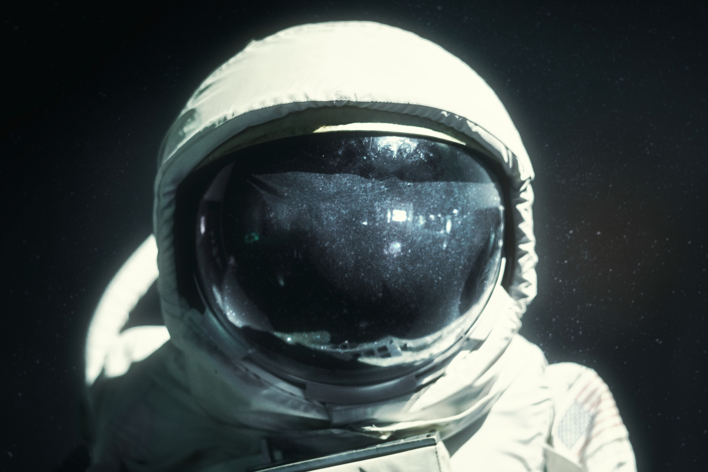
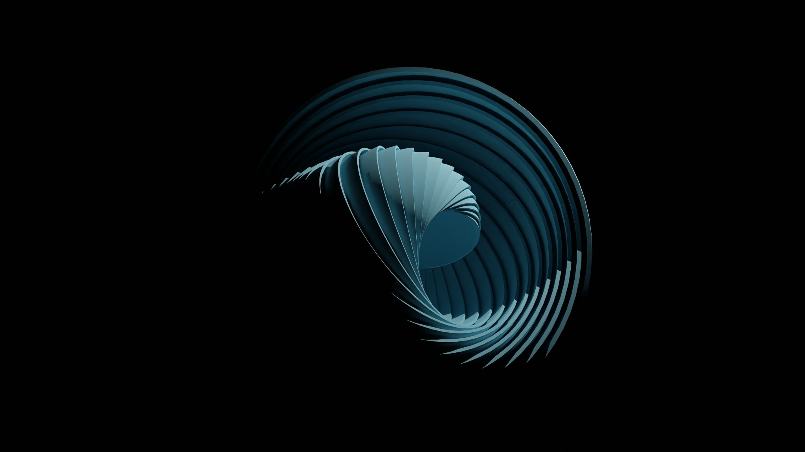
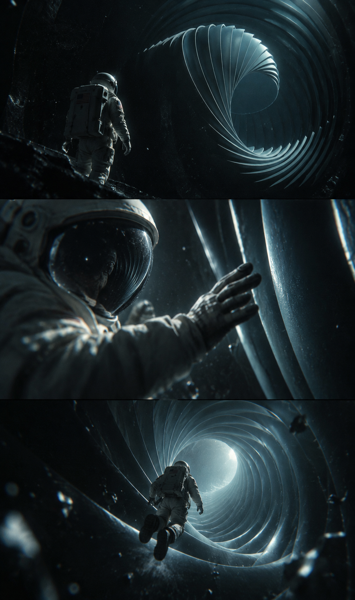
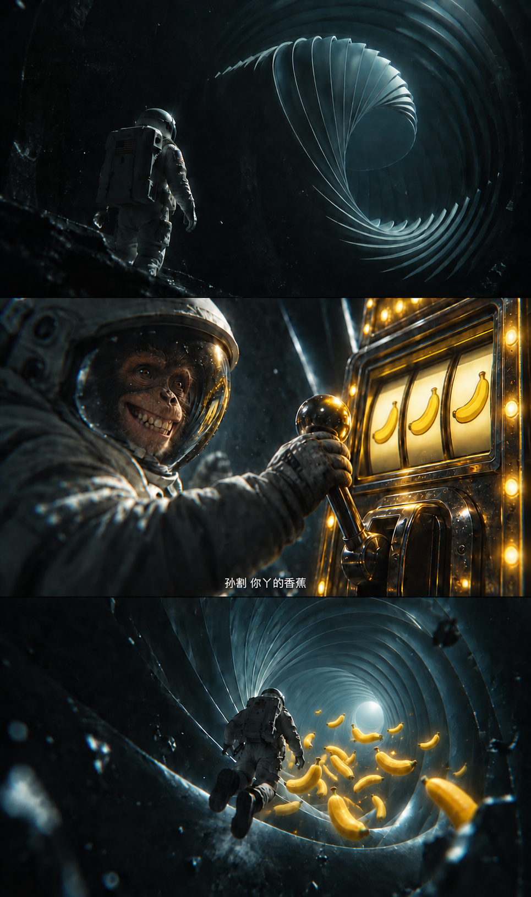
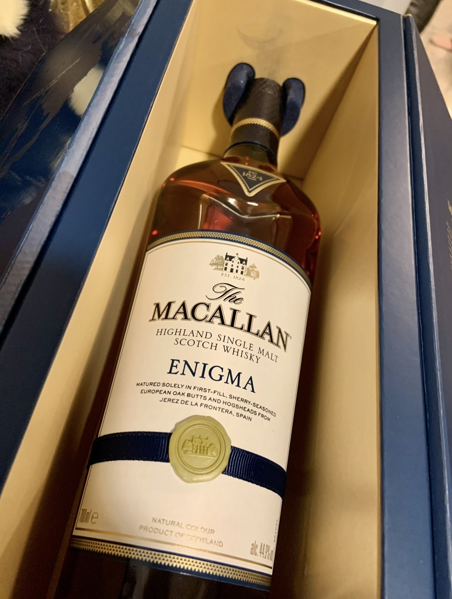
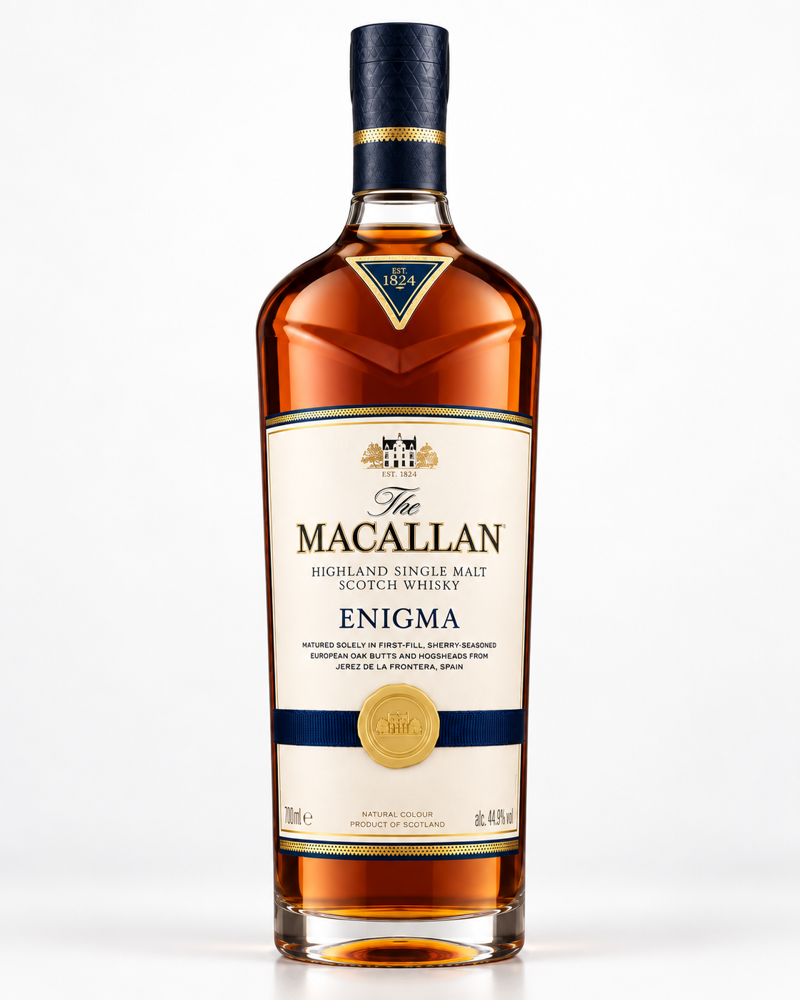
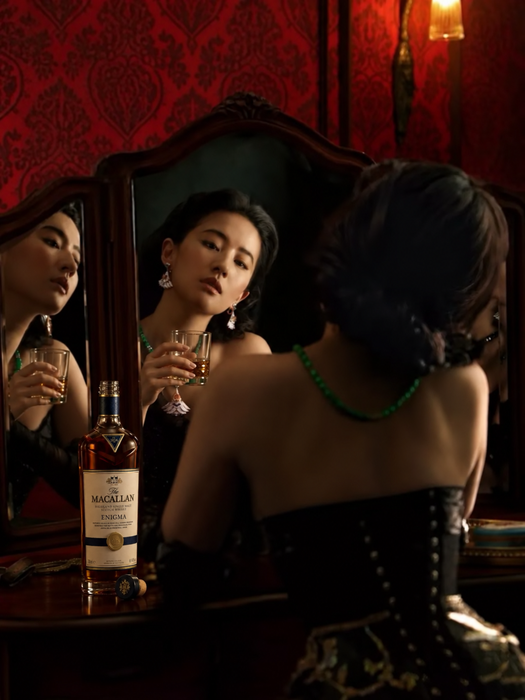
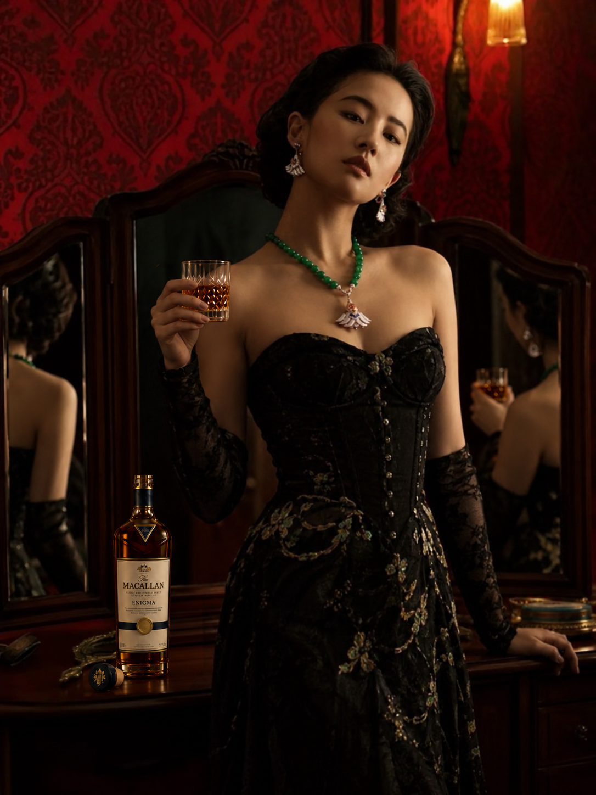

# 实际图片案例：从参考素材到生成与微调

这 8 张图片按两条使用路径排列：**参考图分工 → 成品 → 多轮局部修改**，以及 **产品实拍 → 产品图 → 人物场景延展**。点击图片可查看原尺寸。

Image Prompt Builder 负责把想法整理成具体提示词、区分修改项与保留项，并指导结果检查；图片由配合使用的图像工具生成或编辑。下面的调用文字按案例整理，供复用，不冒充每一轮的原始提示词记录。展示顺序是阅读顺序，不代表每一步都是一次生成完成。

## 案例一：宇航员分镜变成猴子香蕉故事

### 01 · 宇航员参考：头盔与材质



参考头盔造型、面罩反射、宇航服材质和冷色光线。它提供主体的视觉特征，不负责决定整张分镜的构图。

### 02 · 螺旋参考：环境与空间结构



参考层叠、扭转的螺旋结构及蓝黑配色。与上一张分工明确：一张负责宇航员，一张负责环境，避免要求模型笼统地“参考这两张”。

### 03 · 编辑底图：三格宇航员故事



三格依次呈现远景观察、伸手触碰、进入螺旋深处。它是下一步猴子香蕉改图的底图。两张参考素材与这张分镜一起展示多参考图的组织思路；本页不把这张已有底图计作 Skill 从零生成的实测成果。

可复用的多参考图调用：

```text
用 Image Prompt Builder 整理生图提示词。
图1参考宇航员头盔、面罩和服装材质，图2参考螺旋环境和蓝黑配色。
制作竖版三格科幻分镜：远景观察螺旋、近景伸手触碰、背影进入通道。
保持三格的宇航服与环境风格连贯，不把两张参考图简单拼贴，不添加文字。
```

### 04 · 多轮编辑结果：猴子、老虎机与香蕉



与 03 对比，中格头盔里换成咧嘴笑的猴子，手握老虎机拉杆，转轮呈现三个香蕉；底格保留穿行螺旋的叙事，加入明亮的金黄色香蕉。中格底部还有一行小字幕。

这张结果来自逐轮调整：角色与表情 → 拉杆动作和香蕉大奖 → 去掉底格老虎机、保留飞来的香蕉 → 调整字幕大小和位置。

**Skill 在这里的作用：**把“猴子笑着拉老虎机”拆成表情、手部互动和道具位置；把“底下不要老虎机，香蕉保留”限定为底格修改；下一轮沿用已满意的要求，不重新解释整张图。

可复用的局部修改调用（以前一轮含底格老虎机的版本为输入）：

```text
用 Image Prompt Builder 整理这一轮改图指令。
只移除第三格里的老虎机，保留飞来的金黄色香蕉与螺旋通道。
第一格和第二格保持原样，尤其不要改猴子的笑容、握拉杆的动作和机器细节。
列清允许编辑的区域和保护内容；如果要求前两格逐像素一致，使用原图区域合成并检查。
```

字幕轮的要求是“一行小字、不要黑底、再往下一点”，对应准确文字、位置与样式的单独调整。

**如何检查：**猴子是否咧嘴笑、手是否握住拉杆、香蕉是否明亮可辨、底格是否没有机器，以及未授权部分是否发生变化，分开判断。本页上传的是用户选定的最终图片，不将其他版本的像素审计结论套到此文件上；看起来连贯不等于全图逐像素不变，也不是有无 Skill 的对照实验。

## 案例二：酒瓶实拍到产品图与人物场景

### 05 · 产品参考：包装盒中的实拍



这是产品参考：瓶身轮廓、琥珀色酒液、瓶颈包装、标签排版和金色徽章。原片有倾斜视角、包装盒和环境光。

### 06 · 独立产品图：正面、白底、完整瓶身



整理为正面直立、白色背景、完整瓶身的产品展示，突出玻璃反光、酒液和标签。这属于视角与呈现方式的重建，不是只把背景擦除。

可复用调用：

```text
用 Image Prompt Builder 整理产品图提示词。
参考上传的酒瓶实拍，制作正面直立的白底产品图，完整呈现瓶身。
保留可辨认的瓶型、标签内容、深蓝与金色装饰和琥珀色酒液。
移除包装盒与杂乱背景，使用柔和棚拍光和自然接触阴影。
无法辨认的标签小字不要自行编造，指出需要补充的清晰参考。
```

**Skill 的作用：**把“做得有质感”落实到光线、玻璃材质、背景、视角和产品识别细节。检查时要逐项核对瓶型与标签，不能因为整体精致就认定小字完全正确。

### 07 · 场景版本 A：镜前持杯



酒瓶进入红色墙面、木质镜台与暖光的人物场景，人物通过镜面呈现正脸，手持酒杯。这一步把独立商品转为带有叙事的场景图。

### 08 · 场景版本 B：正面站姿持杯



另一种呈现方式：人物转为正面站姿，酒杯、瓶子与镜中反射共同构成画面。它与 07 展示人物动作和构图的延展，不把两图描述成仅改一个局部且背景完全未变的成果。

可复用调用：

```text
用 Image Prompt Builder 整理场景延展提示词。
以镜前人物场景为风格参考，以白底酒瓶图为产品参考。
人物正面站立，一只手自然握住装有琥珀色酒液的玻璃杯，另一只手扶在镜台上。
保留黑色礼服、绿色项链、红色墙面、木质镜台与暖光的视觉设定。
酒瓶放在镜台上，品牌标签朝向镜头。
允许姿势变化所必需的构图、遮挡和镜面反射调整，检查手指、杯子及反射关系。
```

**Skill 的作用：**给参考图分工，写清人物与杯子的互动，并提前说明姿势变化涉及反射和遮挡。此组按用户提供的图片整理使用路径，没有附完整历史调用日志，不据此推断具体模型、生成次数或保真通过率。

## 怎么自己试

1. 按 [安装指南](../README.md#安装与开始) 安装 Skill。
2. 上传对应底图或参考图，说“用 Image Prompt Builder”，再描述需求；上面的文字可直接改用。
3. 将整理后的提示词与相同图片交给图像工具；宿主支持时可在已有出图授权下衔接执行。
4. 对照底图检查修改项和保留项，不满意时只反馈具体问题，沿用认可的版本。

## 素材说明

以上 8 张图片由仓库作者提供并指定公开展示。文件按展示用途重新命名，图片内容未重新生成或修改。螺旋素材的原文件名为 `shubham-dhage-3JjnYjHCK0c-unsplash.jpg`，保留其中的作者署名线索 Shubham Dhage；其余参考素材的原始作者信息未随文件提供。案例素材的权利归各自权利人，仓库代码的 MIT 许可不代表对第三方照片、品牌或肖像另行授权。
